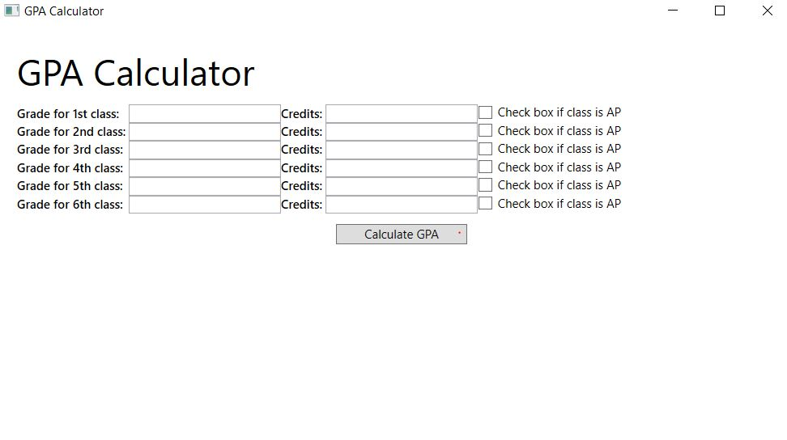

# GPA Calculator

## Why WPF and Why a GPA Calculator?
I am interested in Microsoft's UI frameworks and I wanted to learn about WPF, as well as do something useful. I chose WPF over Winforms as it more flexible, and although this app is simple, I want to invest in learning a technology that will allow me to build sophisticated UI designs in the future.

My younger brother, who is in high school, needs a GPA calculator handy at all times to know his academic standing with his current grades, not just when the report card comes. Many online GPA calculators are confusing (and often rely on different formulas!) so, we had to find the calculations that work for my brother's school, and also take into account different weight of AP vs non-AP classes. 

## What resources did I use?
For some C# basic questions, I mainly consulted the book _C#11 and .NET7_ by Mark J. Price (and a lot of Stack Overflow!). Before this project, I never used WPF, and only heard about it. So, I first learned the basics on YouTube from the amazing IAmTimCorey Channel (https://www.youtube.com/watch?v=gSfMNjWNoX0), and once I got the hang of 
it, I started planning out the UI and logic of my GPA app. For the actual calculation part, I used this resource (https://gpacalculator.net/how-to-calculate-gpa/). 

## How to Run the GPA Project?
You can either download the entire project and open the .sln file in Visual Studio, or pull a .exe file from GPA_Calculator/bin/Debug and run it on your machine. 

## Screenshots of My App Working

